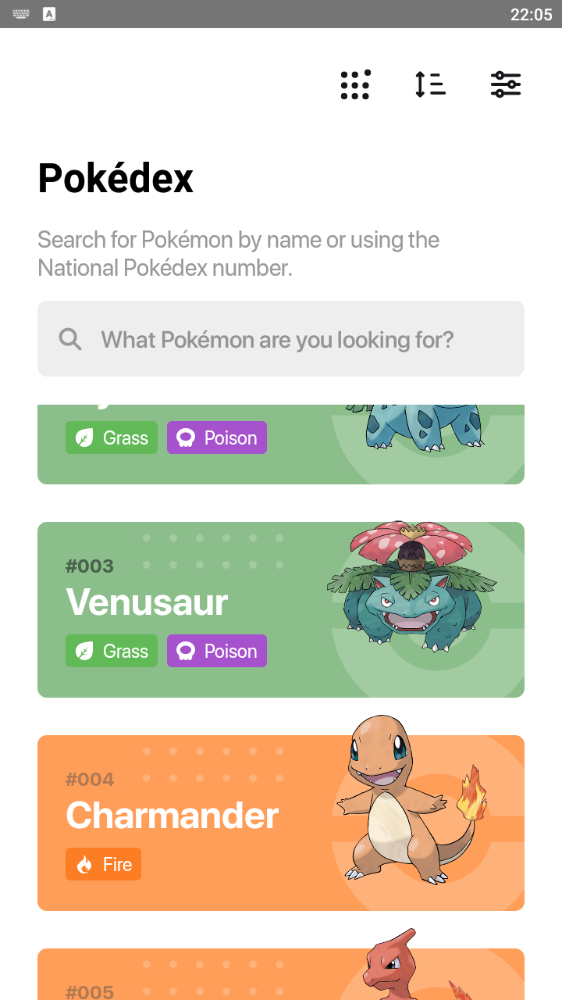
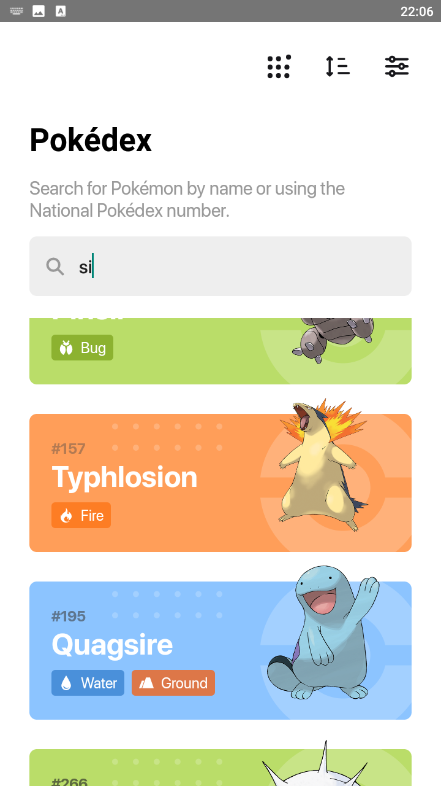
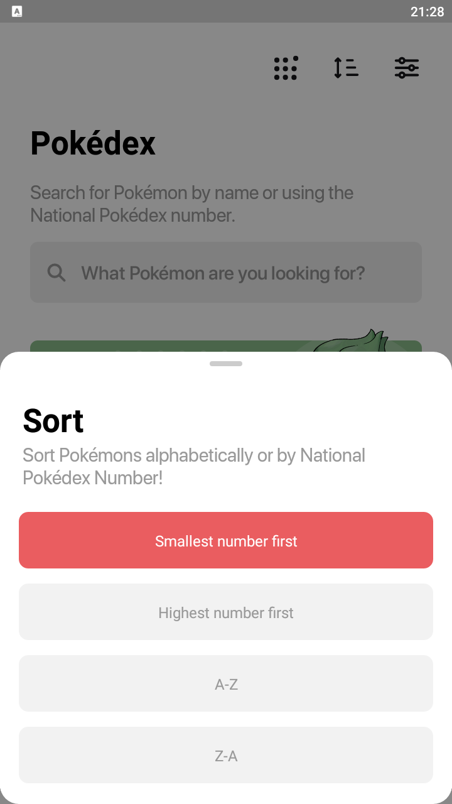
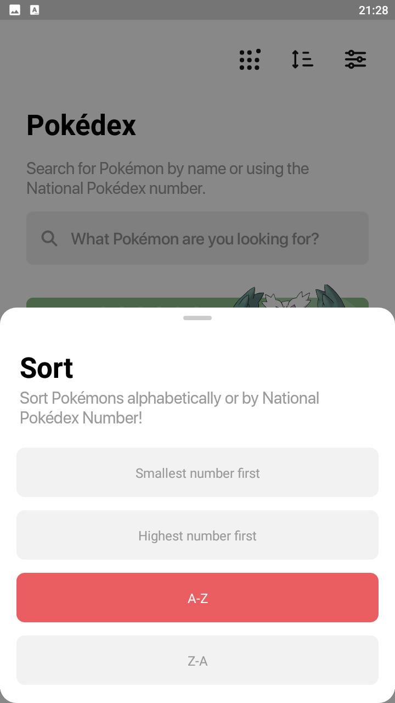
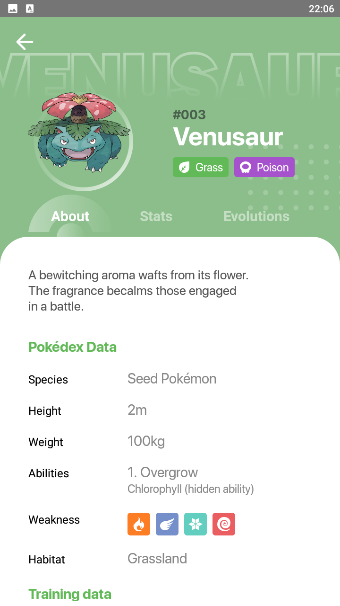
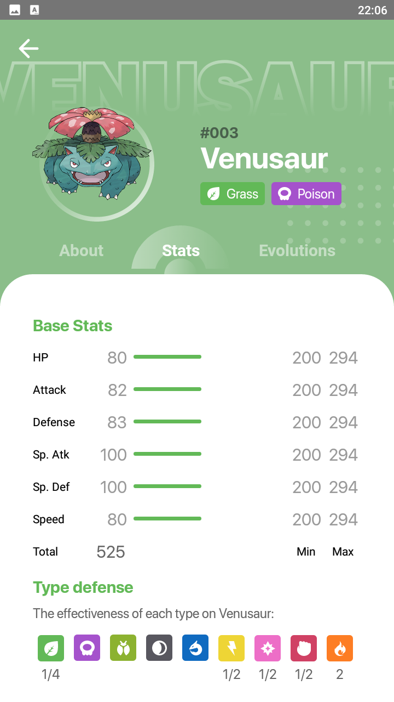
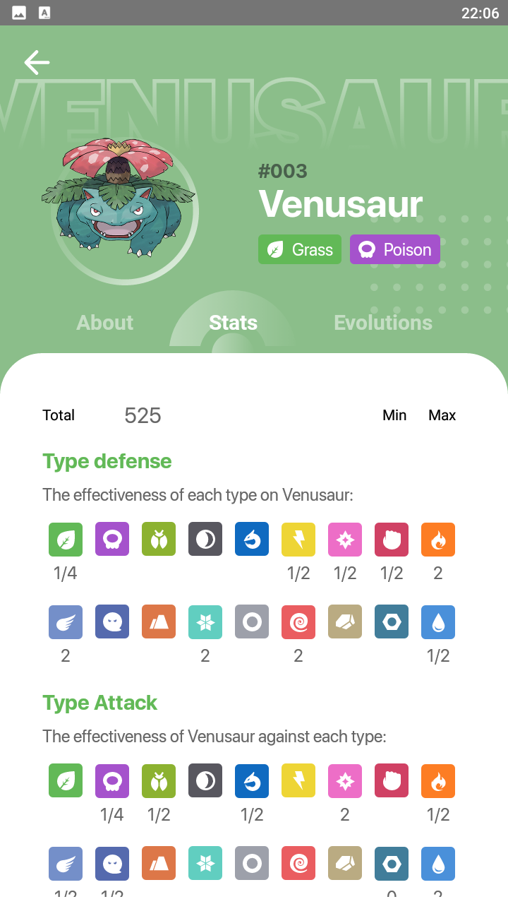
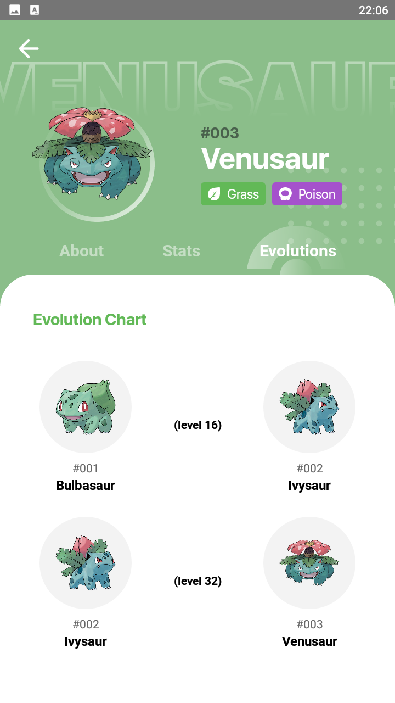

# Pokédex
Este repositório é a minha solução para o desafio do Pokédex da [DevChallenge](https://www.devchallenge.com.br/challenges).

|  |  | 
| ---------------------------------------------- | -------------------------------------------- | 

## 🎌 Objetivos

- Aprender e práticar conhecimentos de react-native e typescript.

## 🛠 Tecnologias

- [React Native](https://reactnative.dev)

## 📁 Libraries

- [Axios](https://www.npmjs.com/package/axios)
- [React Navigation](https://reactnavigation.org/docs/getting-started/)
- [React Navigation Shared Element](https://www.npmjs.com/package/react-navigation-shared-element)
- [React Native Raw Bottom Sheet](https://www.npmjs.com/package/react-native-raw-bottom-sheet)
- [React Native Linear Gradient](https://www.npmjs.com/package/react-native-linear-gradient)
- [React Native SVG](https://www.npmjs.com/package/react-native-svg)
- [React Native Masked View](https://www.npmjs.com/package/@react-native-community/masked-view)

## 📱 Telas do App

### **Tela inicial**

|  |  |  |
| ---------------------------------------------- | -------------------------------------------- | ------------------------------------------- |

### Menu de ordenação

|  |  |  |
| ---------------------------------------------- | -------------------------------------------- | ------------------------------------------- |

### Tela de detalhes

|  |  |  |
| ---------------------------------------------- | -------------------------------------------- | ------------------------------------------- |

|  |  |  |
| ---------------------------------------------- | -------------------------------------------- | ------------------------------------------- |

## ✨ Pré-requisitos

Antes de começar, você vai precisar ter instalado em sua máquina as seguintes ferramentas:
[Git](https://git-scm.com), [nodejs](https://nodejs.org/en/) e o [React Native](https://reactnative.dev/docs/environment-setup) devidamente configurados.

## 🚀 Getting Started

- Clone este repositório.
```
git clone https://github.com/gabriwill/pokedex.git
```
- Execute o comando `npm install` no diretório `Pokedex`.

## :octocat: Autor

Feito com 👨🏻‍💻 por Gabriel Willans 

👋🏽 Entre em contato!

[](https://www.linkedin.com/in/gabriel-willans-780754200/) [](mailto:g.willans@outlook.com)